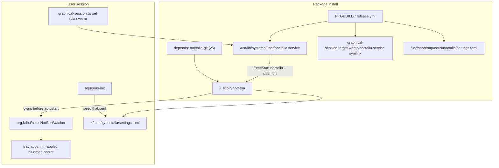

# Requirements

### Overview & Goals

On a fresh package install, `noctalia.service` never registers/starts, so the Noctalia bar and its system-tray watcher (`org.kde.StatusNotifierWatcher`) never come up and tray icons fail to populate.

**Root cause (confirmed):** the repo is mid-migration from Noctalia **v4 (Quickshell)** to Noctalia **v5 (native C++/GLES)**, and the two halves are inconsistent:

- `packaging/noctalia.service` runs `ExecStart=/usr/bin/noctalia --daemon` — this is the **v5** native binary (v5's `--daemon` returns only after the shell has initialised, the readiness barrier the unit relies on).
- `PKGBUILD` / `PKGBUILD-bin` declare `depends=(... 'noctalia-shell' ...)` — `noctalia-shell` is the **v4 Quickshell** package, which installs **no `/usr/bin/noctalia` binary** (only a Quickshell config under `/etc/xdg/quickshell/noctalia-shell/`, launched via `qs -c noctalia-shell`). The v5 package is `noctalia` / `noctalia-git`.

Result: `/usr/bin/noctalia` is never installed → systemd fails the unit with `status=203/EXEC` → the service never starts.

**Goal:** make `noctalia.service` register and start reliably on install, by committing the whole Noctalia integration to **v5** (chosen direction) and removing the leftover v4 (Quickshell) pieces so the pipeline is internally consistent.

### Scope

**In Scope**
- Fix the dependency so the v5 `noctalia` binary is actually installed (`PKGBUILD`, `PKGBUILD-bin`).
- Confirm/adjust `noctalia.service` `ExecStart` path against the v5 package's real binary location.
- Ensure the unit + its `graphical-session.target.wants` symlink are shipped by **both** install paths (the AUR `PKGBUILD` already does; the GitHub release tarball in `.github/workflows/release.yml` currently does **not** ship the unit at all).
- Migrate the seeded default config from v4 `settings.json` to a v5 `settings.toml` and update `aqueous-init` seeding.
- Update v5 IPC usage in `wm.toml` (`[actions]`) and retire the v4-only Quickshell bridge (`packaging/quickshell/OutputControl.qml`) references.
- Update `README.md` and `aqueous.install` messages for v5 consistency.

**Out of Scope**
- Supporting both v4 and v5 simultaneously.
- Re-implementing the output-daemon control surface for v5 (the `aqueous-outputd` socket daemon itself is unchanged; only the dead Quickshell QML consumer is retired).
- Any change to the compositor (RiverDelta) or the .NET WM runtime behaviour.

### User Stories
- As a user installing the `aqueous` package, I want the Noctalia bar/tray to come up automatically on first login, so tray icons (nm-applet, blueman-applet, …) populate without manual steps.
- As a packager, I want `noctalia.service` to point at a binary that the declared dependencies actually install, so the unit doesn't fail with `203/EXEC`.
- As a user, I want the seeded default shell config to be in the format v5 actually reads, so my idle/lock/wallpaper defaults take effect.

### Functional Requirements
1. After a clean install, `/usr/bin/noctalia` (v5) exists because a v5 package is a hard dependency.
2. `systemctl --user status noctalia.service` shows the unit active (not `203/EXEC`) once `graphical-session.target` is reached.
3. The unit is pulled in automatically via the shipped `graphical-session.target.wants/noctalia.service` symlink — no per-user `systemctl --user enable`.
4. Both the AUR package and the GitHub release tarball install the unit and the wants-symlink.
5. The seeded config is a v5 `settings.toml`; `aqueous-init` seeds it (not `settings.json`) when absent.
6. `wm.toml` launcher action uses the v5 IPC form (`noctalia msg panel-toggle launcher`) instead of `qs -c noctalia-shell ipc call ...`.
7. No remaining packaging/doc reference implies the v4 Quickshell shell is the runtime bar.

### Non-Functional Requirements
- The `Before=xdg-desktop-autostart.target` ordering must still hold against a genuine readiness barrier (preserved by v5 `--daemon`).
- Changes must be idempotent and non-destructive to existing user config (seeding only when absent, as today).

# Technical Design

### Current Implementation

- **`packaging/noctalia.service`** — `Type=exec`, `ExecStart=/usr/bin/noctalia --daemon`, `WantedBy=graphical-session.target`, `Before=xdg-desktop-autostart.target`. Correct for **v5**.
- **`PKGBUILD`** (`aqueous-git`): `depends=(... 'noctalia-shell' ...)` (line 13) → **v4 Quickshell** package (no binary). `package()` installs `noctalia.service` to `/usr/lib/systemd/user/` and creates `graphical-session.target.wants/noctalia.service` symlink (lines 202–206). Also installs the Quickshell bridge `packaging/quickshell/OutputControl.qml` (lines 215–216) and the v4 `packaging/noctalia/settings.json` (lines 220–221).
- **`PKGBUILD-bin`**: same `'noctalia-shell'` dependency.
- **`packaging/aqueous-init`** (lines 33–39): seeds `~/.config/noctalia/settings.json` from `/usr/share/aqueous/noctalia/settings.json` (v4 format/path).
- **`packaging/noctalia/settings.json`**: v4 schema (`general` / `idle` / `wallpaper`). v5 uses `settings.toml` with a different schema and does **not** migrate v4 settings.
- **`packaging/quickshell/OutputControl.qml`**: a `Quickshell.Io`-based QML module — only loadable by v4 (Quickshell). v5 is native C++ with no Quickshell, so this bridge has no consumer under v5.
- **`wm.toml`**: `[actions] toggle_start_menu = "qs -c noctalia-shell ipc call launcher toggle"` (v4 IPC). `[struts]` and comments reference the Noctalia bar/SNI design.
- **`.github/workflows/release.yml`**: builds the tarball but does **not** copy `noctalia.service` nor create the wants-symlink; it does copy `packaging/quickshell/*.qml` and `packaging/noctalia/*.json` (lines 150–158). So tarball installs ship no Noctalia unit at all.
- **`launch_river.sh`** (dev): already defaults `NOCTALIA_CMD` to `noctalia` (v5) — aligned.
- **`Aqueous.Tests/ExecConfigTests.cs` / `StartupExecRunnerTests.cs`**: use `qs -c noctalia-shell` only as sample `[[exec]]` TOML fixtures; they validate the exec-config parser, not Noctalia itself.

### Key Decisions
- **Commit to Noctalia v5** (user-selected). Align the dependency and all packaging/config/docs to v5; retire v4 Quickshell pieces. Rationale: the unit + README already target v5, and v5 `--daemon` is the only option that preserves the readiness-barrier semantics the `Before=xdg-desktop-autostart.target` ordering depends on.
- **Dependency target:** depend on the v5 AUR package that provides `/usr/bin/noctalia`. For `aqueous-git` use `noctalia-git`; for `aqueous` (`PKGBUILD-bin`) prefer the stable `noctalia` package if available, otherwise `noctalia-git`. Verify the package's meson prefix installs to `/usr/bin/noctalia` (the path in `ExecStart`); if it installs to `/usr/local/bin`, adjust `ExecStart` to match.
- **Config format:** replace the seeded v4 `settings.json` with a minimal v5 `settings.toml` (wallpaper directory + idle/lock timeouts expressed in v5's schema), seeded by `aqueous-init`. v5 ships sane defaults, so the seed stays minimal and is only applied when absent.
- **Quickshell bridge:** retire `packaging/quickshell/OutputControl.qml` and its install/copy/import references, since v5 cannot load Quickshell QML. The `aqueous-outputd` socket daemon stays (it is independent of the bar).

### Proposed Changes

1. **Dependency fix (core).**
   - `PKGBUILD`: replace `'noctalia-shell'` with the v5 package (`'noctalia-git'`).
   - `PKGBUILD-bin`: same replacement (prefer `'noctalia'` if a stable v5 package exists).
   - Verify `/usr/bin/noctalia` is the installed path; keep `ExecStart=/usr/bin/noctalia --daemon` (or adjust if the package uses `/usr/local/bin`).

2. **Ship the unit from the release tarball.**
   - `.github/workflows/release.yml`: copy `packaging/noctalia.service` into `lib/systemd/user/` and create the `lib/systemd/user/graphical-session.target.wants/noctalia.service` symlink (mirroring `PKGBUILD`). Ship the new v5 `settings.toml` instead of `settings.json`. Drop the `packaging/quickshell/*.qml` copy.

3. **Config migration to v5 TOML.**
   - Add `packaging/noctalia/settings.toml` (v5 schema) and remove/replace `packaging/noctalia/settings.json`.
   - `PKGBUILD` / `PKGBUILD-bin`: install `settings.toml` to `/usr/share/aqueous/noctalia/settings.toml`.
   - `packaging/aqueous-init`: seed `~/.config/noctalia/settings.toml` from the shipped default when absent (update path + filename).

4. **v5 IPC + retire Quickshell bridge.**
   - `wm.toml`: change `toggle_start_menu` to `noctalia msg panel-toggle launcher`; update Noctalia-related comments to v5 wording.
   - Remove `packaging/quickshell/OutputControl.qml` install from `PKGBUILD`/`PKGBUILD-bin` and its copy from `release.yml`; update or drop the `share/aqueous/quickshell` references.

5. **Docs / install messages.**
   - `README.md`: make the Noctalia description consistently v5 (remove the `qs`/Quickshell phrasing that conflicts); keep the kded6 tray-troubleshooting note (still valid for v5).
   - `aqueous.install`: ensure the post-install text matches v5 (binary, settings.toml seeding); keep the tray-watcher explanation.

### Data Models / Contracts

```

# packaging/noctalia.service (unchanged target, verified)

[Service]
Type=exec
ExecStart=/usr/bin/noctalia --daemon   # v5 native; --daemon = readiness barrier
Restart=on-failure

[Install]
WantedBy=graphical-session.target
```

v5 IPC mapping (v4 → v5):
```
qs -c noctalia-shell ipc call launcher toggle   ->   noctalia msg panel-toggle launcher
```

### File Structure
- Modified: `PKGBUILD`, `PKGBUILD-bin`, `.github/workflows/release.yml`, `packaging/aqueous-init`, `wm.toml`, `wm.toml.example` (if it mirrors), `README.md`, `aqueous.install`.
- Added: `packaging/noctalia/settings.toml`.
- Removed: `packaging/noctalia/settings.json`, `packaging/quickshell/OutputControl.qml` (and empty `packaging/quickshell/` if nothing else remains).
- Verified (likely unchanged): `packaging/noctalia.service`, `launch_river.sh`.

### Architecture Diagram



### Risks
- **Binary path drift:** if the chosen v5 package installs to `/usr/local/bin/noctalia`, `ExecStart` must be updated; verify before finalising.
- **v5 config schema:** v5 is alpha with breaking config changes; the seeded `settings.toml` keys must be checked against the current v5 docs, and the seed kept minimal to avoid breaking on schema churn.
- **Loss of output-panel control under v5:** retiring the Quickshell `OutputControl.qml` removes the shell's path to drive outputs via the daemon; acceptable for now (daemon still applies persisted/profile configs), note it in docs.
- **Mixed v4 installs:** users who already pulled `noctalia-shell` (v4) will get `noctalia-git` added; the two can coexist on disk but only v5 is wired into the session.

# Testing

### Validation Approach

This is a packaging/config change with no compiled runtime path, so validation is primarily static analysis, packaging dry-runs, and a residual-reference audit. Where a live systemd user session is available, verify the unit actually starts.

### Key Scenarios
- **Unit validity:** `systemd-analyze verify packaging/noctalia.service` reports no errors; `ExecStart` path matches the v5 package's installed binary.
- **Dependency installs the binary:** confirm the chosen v5 package (`noctalia-git` / `noctalia`) provides `/usr/bin/noctalia` (inspect its file list / `pacman -Ql` or the package's meson prefix).
- **Symlink + unit shipped by both paths:** `PKGBUILD package()` and `release.yml` both place `noctalia.service` under `lib/systemd/user/` and create the `graphical-session.target.wants` symlink.
- **Config seeding:** `aqueous-init` seeds `~/.config/noctalia/settings.toml` (not `.json`) when absent and never overwrites an existing one; the shipped `settings.toml` is valid TOML.
- **IPC action:** `wm.toml` launcher action uses `noctalia msg panel-toggle launcher`.
- **(If a session is available):** after install + login, `systemctl --user status noctalia.service` is active (no `203/EXEC`), and `busctl --user list | grep -i StatusNotifier` shows the watcher owned before tray apps.

### Edge Cases
- Existing user `~/.config/noctalia/settings.json` (v4) present: seeding must not clobber it; document that v4 settings are not migrated.
- v5 package installs to `/usr/local/bin`: ensure `ExecStart` was adjusted, else `203/EXEC` persists.
- Tarball (release.yml) install: ensure the unit + symlink + `settings.toml` are present in `publish/aqueous-linux-x64/`.

### Test Changes
- `Aqueous.Tests/ExecConfigTests.cs` and `StartupExecRunnerTests.cs` use `qs -c noctalia-shell` only as parser fixtures and remain valid; optionally update the sample command strings to the v5 form for consistency (not required for correctness). Run `dotnet test` to confirm no regressions after any fixture edits.
- Run `shellcheck packaging/aqueous-init` and a TOML lint on `packaging/noctalia/settings.toml` and `wm.toml`.
- `grep -ri 'qs -c noctalia-shell\|noctalia-shell\|settings.json' packaging PKGBUILD* wm.toml README.md` should return only intentional/historical references after the change.

# Delivery Steps

### ✓ Step 1: Fix dependency and confirm the unit's ExecStart (core start fix)
After install, `/usr/bin/noctalia` (v5) exists and `noctalia.service` no longer fails with 203/EXEC.

- In `PKGBUILD`, replace `'noctalia-shell'` in `depends` with the v5 package `'noctalia-git'`.
- In `PKGBUILD-bin`, replace `'noctalia-shell'` with the v5 package (prefer stable `'noctalia'` if available, else `'noctalia-git'`).
- Verify the chosen v5 package installs the binary at `/usr/bin/noctalia` (meson prefix `/usr`); keep `packaging/noctalia.service` `ExecStart=/usr/bin/noctalia --daemon`, or adjust the path if the package installs to `/usr/local/bin`.
- Validate the unit with `systemd-analyze verify packaging/noctalia.service`.

### ✓ Step 2: Ship the unit + wants-symlink from the release tarball
Both the AUR package and the GitHub release tarball install the unit and its auto-enable symlink.

- In `.github/workflows/release.yml`, copy `packaging/noctalia.service` into `publish/aqueous-linux-x64/lib/systemd/user/`.
- Create the `lib/systemd/user/graphical-session.target.wants/noctalia.service` symlink in the tarball, mirroring `PKGBUILD` lines 204–206.
- Confirm `PKGBUILD`/`PKGBUILD-bin` already install the unit + symlink (no change needed there beyond the dependency).

### ✓ Step 3: Migrate seeded default config from v4 settings.json to v5 config.toml
The seeded default config is in the TOML format v5 actually reads, seeded only when absent.

NOTE (user decision): the seed file is named `config.toml`, not `settings.toml`. Per the v5 docs the hand-written declarative base config lives in `~/.config/noctalia/config.toml`, while `settings.toml` is the GUI-managed override file that lives in `~/.local/state/noctalia/`. v5 merges every `*.toml` in the config dir, so `config.toml` is loaded as the base layer.

- Add `packaging/noctalia/config.toml` using the v5 config schema (`[wallpaper]` directory under `/usr/share/aqueous/wallpapers` + `[wallpaper.automation]`, `[lockscreen]` blur, `[idle.behavior.lock]`/`[idle.behavior.screen-off]` timeouts), kept minimal and verified against upstream `example.toml`.
- Remove `packaging/noctalia/settings.json`.
- Update `PKGBUILD` to install `config.toml` to `/usr/share/aqueous/noctalia/config.toml` (`PKGBUILD-bin` copies the whole share tree from the tarball, so no per-file edit needed there).
- Update `packaging/aqueous-init` to seed `~/.config/noctalia/config.toml` from the new default, non-destructively.
- Update `release.yml` to copy `*.toml` instead of `*.json`.

### ✓ Step 4: Switch to v5 IPC and retire the v4 Quickshell bridge
Runtime IPC and packaging assets no longer reference the v4 Quickshell shell.

- In `wm.toml` (and `wm.toml.example` if mirrored), change `toggle_start_menu` from `qs -c noctalia-shell ipc call launcher toggle` to `noctalia msg panel-toggle launcher`, and update Noctalia comments to v5 wording.
- Remove `packaging/quickshell/OutputControl.qml` and drop its install lines from `PKGBUILD`/`PKGBUILD-bin` and its copy block from `release.yml`.
- Remove now-unused `share/aqueous/quickshell` references; leave `aqueous-outputd` and its socket daemon untouched.
- Optionally update the `qs -c noctalia-shell` sample strings in `Aqueous.Tests/ExecConfigTests.cs` / `StartupExecRunnerTests.cs` to the v5 form and run `dotnet test`.

### ✓ Step 5: Align documentation and install messages with v5
README and post-install messaging consistently describe the v5 native shell.

- Update `README.md` so the Noctalia description is v5-only (remove conflicting `qs` / Quickshell phrasing, keep the `noctalia --daemon` readiness-barrier rationale and the kded6 tray-troubleshooting note).
- Update `aqueous.install` post_install/post_upgrade text to reference the v5 binary and `settings.toml` seeding while keeping the tray-watcher ordering explanation.
- Run a final `grep` audit for residual `noctalia-shell` / `qs -c noctalia-shell` / `settings.json` references and confirm only intentional ones remain.