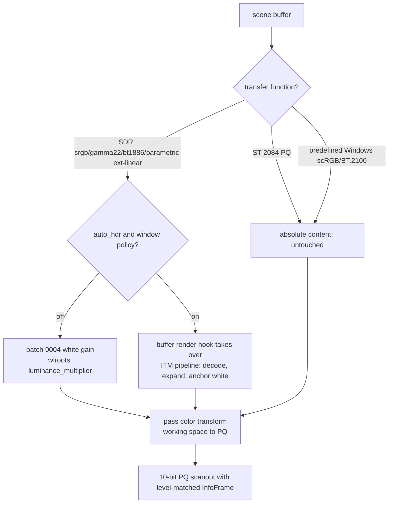

# Auto HDR (SDR→HDR Expansion) Implementation Plan

## Status

Stage A is implemented: the expansion shader (phase 1), render-path
integration (phase 2), configuration and rules (phase 3), and the test
surface (phase 4) are in tree. One documented deviation: the default
window policy expands fullscreen windows and rule-overridden windows;
game-mode anchor detection is deferred (the `hdr_expand` rule covers it
explicitly in the meantime). Headless pixel readback is not possible
because HDR requires a DRM output; `scripts/test-auto-hdr.sh` covers the
configuration wire contract and `auto_hdr.zig` unit tests pin the curve.

## Objective

When an output runs the HDR10 profile, expand SDR content highlights toward
the display's peak luminance in the style of Microsoft Windows Auto HDR,
while preserving SDR creative intent at and below diffuse white.

The feature ships in two stages behind one interface:

- **Stage A (this plan)**: an analytic highlight-expansion shader ("curve
  engine"), comparable to the well-known FakeHDR heuristic.
- **Stage B (appendix)**: a trained model that replaces the curve with
  content-aware expansion, keeping the same render path and configuration
  surface.

Windows has two HDR mechanisms for SDR content. The "SDR content brightness"
slider — a linear white-point gain — is already implemented by the
`sdr_white_level` scene patch. Auto HDR — highlight reconstruction above SDR
white — is what this plan adds.

## Prerequisites already in place

The HDR levels work provides everything the expansion stage builds on:

- `sdr_white_level` scene scaling (wlroots patch 0004): per-buffer
  `luminance_multiplier` for relative-luminance content, gated on the same
  "buffer TF is not ST 2084 PQ" predicate this feature needs.
- `HdrLevel` presets (100/400/1000 cd/m²) with matching `HDR_OUTPUT_METADATA`
  InfoFrames — the expansion's peak target and the guarantee that content
  capped at the level is not clipped by the display.
- EDID desired-content luminances (wlroots patch 0005) for level selection.
- The wlroots render-hook patch (0001): `wlr_scene_output_set_buffer_render_hook`
  already lets Aqueous take over per-buffer texture rendering with its own
  Vulkan pipelines (`RoundedPipeline.drawTexture`), returning `false` to fall
  back to wlroots' own draw.
- The `EffectMetadata` per-buffer data store and the blur pipeline as the
  in-tree precedent for compositor-owned Vulkan passes with checked-in GLSL
  plus `.spv` (compiled with `glslangValidator -V`, see the window-drag
  overlay tutorial).

## Scope

### Included behavior

- Per-buffer highlight expansion for SDR (relative-luminance) buffers
  composited on an HDR output.
- Expansion bounded by the output's configured HDR level peak; SDR white
  stays anchored at `sdr_white_level`.
- Global per-output toggle in `outputs.toml`/`wm.toml` and the output
  service protocol.
- Per-window override through `rules.toml`, with Windows-like defaults
  (fullscreen/game content expanded, desktop chrome not).
- Silent degradation: without the Vulkan effects build or on non-DRM
  outputs the toggle is inert, like other effect features.

### Excluded behavior (stage A)

- Expansion of compositor-generated rects and single-pixel buffers (they
  stay anchored at the working white, consistent with the `sdr_white_level`
  patch).
- Tone mapping or roll-off of genuine HDR (PQ) content above the level peak.
- Per-frame ML inference (stage B, appendix only).
- HLG content (wlroots 0.20 has no HLG transfer function).

## Architecture



Key decisions:

1. **Injection point: the existing buffer render hook, no new wlroots patch.**
   The hook returns `true` when Aqueous draws the buffer itself, which
   bypasses wlroots' texture shader — including the patch 0004
   `luminance_multiplier`. The ITM shader therefore owns the white anchor:
   at boost 0 it must reproduce the patch 0004 gain exactly.
2. **One draw per buffer.** ITM is folded into the rounded-texture pipeline
   as an additional uniform set, so a buffer needing both corner rounding
   and expansion stays a single custom draw.
3. **Working-space math.** Expansion operates in the linear working space
   where 1.0 = 203 cd/m² (wlroots' PQ reference white). Inputs: `W =
   sdr_white_level / 203` (white anchor), `P = level_nits / 203` (peak).
4. **Stage A/B interface stability.** The hook, uniforms, and config surface
   are designed so stage B swaps the curve for a model-produced gain field or
   3D LUT without touching the plumbing. A later `auto_hdr_engine =
   "curve" | "model"` key can select the engine without breaking the boolean
   toggle.

## Phase 1 — Expansion shader (curve engine)

New files, following the blur/rounded shader convention:

- `compositor/aqueous/render/shaders/auto_hdr_texture.frag` (plus `.vert` if
  the rounded texture vertex shader cannot be reused) and checked-in `.spv`
  compiled with `glslangValidator -V`.
- Reference implementation and unit tests in a new
  `compositor/aqueous/auto_hdr.zig` (registered in `build.zig` next to
  `output_hdr_test`).

Curve sketch (per pixel, decoded linear working-space color `c`):

```
L = luma(c)                          // BT.709 coefficients
m = smoothstep(knee, 1.0, L)         // highlight mask, knee ≈ 0.8 uniform
s = W + boost * (P - W) * m          // per-pixel luminance scale
c' = clampLuma(c * s, P)             // hue-preserving scale, clamp at peak
```

Required properties (all unit-tested in the Zig reference):

- `boost = 0` degenerates to `c' = c * W` — bit-equivalent intent to the
  patch 0004 gain, so enabling auto HDR at zero boost changes nothing.
- Monotonic in `L`; continuous at the knee; `c' = 0` for `c = 0`.
- Output luminance never exceeds `P`, including for extended-range (scRGB)
  inputs above 1.0.
- Hue-preserving: uniform RGB scale; optional chroma clamp to avoid
  oversaturated highlights.

Uniforms: `W`, `P`, `boost`, `knee`. `boost` is exposed as
`auto_hdr_boost` (0–1, default 0.5); `knee` stays internal initially.

Known stage A trade-off (shared with FakeHDR): a static curve cannot
distinguish a white UI dialog from a white sky, so near-whites lift by up to
`boost * (P - W)`. The policy defaults in phase 3 keep this away from
desktop chrome; stage B removes the trade-off with spatially varying gain.

## Phase 2 — Render path integration

Steps:

1. **Investigation (blocking)**: confirm how `RoundedPipeline` composes with
   the render pass output color transform on HDR outputs today (the pass
   carries the working-space→PQ transform via
   `wlr_buffer_pass_options.color_transform`). Rounded corners predates HDR
   support; if the custom pipeline misbehaves under a PQ output transform,
   fix that first — ITM inherits the same composition.
2. **Hook decision** in `Output.zig` (generalize `roundedBufferHook`):
   take over the draw when the buffer is SDR (`scene_buffer.transfer_function`
   not PQ), is not tagged with a predefined Windows-scRGB/BT.2100 image
   description, the output has HDR active (`Output.hdr.active`), the output's
   scheduled state has `auto_hdr` enabled, and the buffer's `EffectMetadata`
   allows expansion (phase 3 flag). Everything else falls through exactly as
   today. A parametric extended-linear description remains eligible; the
   bypass is based on description identity, not transfer function alone.
3. **Pipeline**: extend `RoundedPipeline` (or add an `AutoHdrPipeline` in
   `VulkanContext` if the uniform sets diverge too much) with the ITM
   fragment stage and the uniforms above. Failure paths return `false` so
   wlroots draws the buffer with the plain white gain — safe degradation.
4. **Damage**: toggling `auto_hdr` or changing `auto_hdr_boost` calls the
   whole-output damage path (same pattern as `damageBlurAppearance`). No
   modeset is needed: swapchain format and image description are unchanged.
5. **Interactions documented up front**:
   - Direct scanout: unaffected — SDR buffers already cannot scan out on an
     HDR output (transfer-function mismatch), PQ scanout stays absolute.
   - Backdrop blur samples pre-expansion content in stage A (blur sees the
     white gain only); revisit if highlight bleed into blur is requested.
   - Screen capture shows expanded content, matching what is displayed.
   - Lock screen and layer-shell surfaces never expand (phase 3).
   - Native Wine/Proton Windows HDR descriptions never expand a second time;
     Windows-scRGB also keeps its fixed 80-nit-per-1.0 stimulus mapping.
6. **Capability gate**: `auto_hdr` is inert unless the build has
   `vulkan_effects`, the output is DRM, and HDR is active. The service
   reports this (phase 3).

## Phase 3 — Policy and configuration

The toggle rides the exact loop built for `hdr_level`:

| Layer | Change |
| --- | --- |
| `wm/output/config.zig` | `Spec.auto_hdr: ?bool`, `Spec.auto_hdr_boost: ?f64` (0–1), parsing + validation + tests |
| `Output.State` | `auto_hdr: bool`, `auto_hdr_boost: f64`; defaults false/0.5 in `create` and `fromHeadState`; preserved in `handleManagerApply` |
| `OutputManager.applySpecToState` | apply both fields |
| `wm/output/Service.zig` | `specFromJson` accepts both; `writeOutputs` reports `auto_hdr`, `auto_hdr_boost`, `auto_hdr_capable`; `persistProfile` writes them; `outputFingerprint` hashes both |
| `plugin/helper` | add keys to `hasLegacyDisplayPolicy` |
| Config templates/docs | `outputs.toml`, `wm.toml`, `docs/compositor-interactions.md` |

`auto_hdr` is deliberately *not* added to `output_hdr.stateMatches`: it
changes pixel processing, not output color state, so it needs damage, not a
modeset.

Per-window policy (Windows-like defaults):

- New `[[window]]` rule key `hdr_expand = bool` in `rules.toml`
  (`docs/rules.md` schema table updated), resolved in the rules engine.
- Default when the output has `auto_hdr` enabled: expand fullscreen
  toplevels and game-mode anchors; do not expand other tiled/floating
  windows, layer-shell surfaces, or anything on the lock screen.
- Plumbing follows the effect-radii pattern: rule → `Window` flag →
  `EffectMetadata` on buffer attach → hook decision.

## Phase 4 — Tests and validation

1. **Unit tests** (`auto_hdr.zig`): the curve properties listed in phase 1,
   including boost-0 equivalence with the white gain and peak clamping for
   extended inputs.
2. **Shader parity**: the readback harness asserts the GPU output matches
   the Zig reference within tolerance on a gray ramp.
3. **Headless Vulkan script** `compositor/scripts/test-vulkan-auto-hdr.sh`,
   modeled on `test-vulkan-effects.sh`: fixtures for an SDR gray ramp, a
   near-white gradient, and a PQ reference buffer; assertions for black
   preservation, white anchoring at `W` (boost 0), monotonic lift (boost >
   0), clamp at `P`, and untouched PQ buffers.
4. **Config/rules tests**: extend the `config_tests` and rules suites with
   `auto_hdr`/`auto_hdr_boost` parsing, invalid values, and `hdr_expand`
   rule resolution.
5. **Performance budget**: frame-time delta ≤ 0.5 ms at 1440p on a mid-range
   GPU with one expanded fullscreen surface; measured with the render
   metrics path.
6. **Manual matrix**: extend `compositor/doc/scaling-test-matrix.md` (or a
   new `hdr-test-matrix.md`) with SDR desktop, SDR video, fullscreen game
   fixture, PQ reference, and scRGB extended rows; rerun
   `scripts/test-policy-parity.sh`.

## Milestones

| Milestone | Content | Depends on |
| --- | --- | --- |
| M1 | Phase 2 step 1 investigation + phase 1 shader + hook with global toggle only | — |
| M2 | Phase 3 config/rules loop | M1 |
| M3 | Phase 4 full validation and docs | M2 |
| M4 | Stage B model engine (appendix) behind the same interface | M3 |

## Risks

- **Pass color transform composition** (phase 2 step 1) is the largest
  unknown; it may surface a pre-existing rounded-pipeline gap on HDR
  outputs or require a small additional wlroots patch to expose pass state
  to hooks.
- Static-curve artifacts on UI content are mitigated by policy, not solved,
  until stage B.
- Boost defaults are subjective; expose the knob and keep a conservative
  default.

## Appendix A — Training an Auto HDR model (stage B)

Windows' Auto HDR is a proprietary model trained on paired game content and
applied per swap chain through DWM/DirectML. An open reconstruction has four
parts: paired data, an architecture cheap enough for a compositor, losses
that respect HDR perception, and a deployment path that keeps the real-time
render loop shader-only.

### 1. Problem formulation

Learn a mapping from SDR content to HDR radiance. Three formulations, in
increasing cost and expressiveness:

1. **Global parameter prediction**: the model predicts curve parameters
   (knee, boost, shoulder) per scene. Cheapest; little better than stage A.
2. **Per-pixel gain field**: the model predicts a spatially varying gain
   `G(x,y) ≥ 1` applied as `c' = clamp(c * W * G, P)` — the stage A shader
   consumes the gain field unchanged. This is the recommended target: the
   network decides *where* highlights live (sky, lamps, speculars) while the
   shader keeps colorimetry exact.
3. **3D LUT prediction** (cf. "Image-Adaptive 3D LUT", CVPR 2022): the
   model outputs a small 3D LUT (e.g. 33³) applied by trilinear fetch.
   Extremely cheap at inference and compositor-friendly, but has no spatial
   selectivity — it cannot spare a white dialog while lifting a white sky.

### 2. Training data (paired SDR/HDR)

Supervised inverse tone mapping needs aligned (SDR, HDR) pairs:

- **Synthetic engine renders (best source)**: render scenes in Unreal,
  Unity, or Blender Cycles at float linear HDR; the engine output is the HDR
  ground truth, and applying a standard tone mapper (BT.2390, Hable, ACES)
  produces the paired SDR input. Perfect alignment, unlimited variety, and
  varying the tone mapper teaches robustness to whatever mapping created a
  given SDR image. Include UI/desktop scenes as a *negative class* (target =
  no expansion) so the model learns when not to fire — this is the property
  Windows gets from its game-only heuristics.
- **Public datasets**: HDRTV1K/HDRTV4K (large-scale HDR video, CVPR 2022)
  with SDR sides synthesized via BT.2390; ITU/BT HDR reference sequences;
  HDR-VDP test imagery. Licensed UHD material can augment volume but mind
  redistribution.
- **Augmentation**: crops, flips, exposure jitter, and SDR white-point
  jitter so the model sees the anchor as a condition, not a constant.

A practical corpus for this narrow task: ~50–100k 256² patches, roughly
70% game/cinematic, 20% video, 10% UI/desktop negatives.

### 3. Architecture and budget

Compositor constraints: every visible SDR surface, every frame, on whatever
GPU the user has, with no dedicated ML runtime.

- Recommended: a small CNN (6–10 depthwise-separable conv layers, ≤ ~1M
  parameters, fp16) predicting `log G` at half resolution, upsampled with a
  bilateral/guided filter to avoid halos at highlight edges. Target ≤ 1.5 ms
  at 1440p on mid-range hardware.
- Train the full network, then **distill** into the deploy form: either the
  half-res gain net above or a LUT-predictor head. Quantize to fp16; int8
  only if profiling demands it.

### 4. Losses

- **L1 in the PQ domain** as the base loss — PQ approximately uniformizes
  perceptual error across the luminance range, which is exactly what this
  task needs.
- PU21-weighted L1 (perceptually uniform encoding for HDR) as a validation
  metric and optional loss term.
- **Expansion-only regularizer**: penalty on `G < 1` — Auto HDR must never
  dim content.
- **Identity regularizer on the negative class**: UI patches should predict
  `G ≈ 1`.
- Edge/gradient penalty to suppress halos around lifted highlights.
- Temporal consistency loss (adjacent-frame prediction agreement) if video
  content matters; flicker is the most visible failure mode.

### 5. Training recipe

PyTorch with AMP; AdamW, cosine schedule; patches of 256²; 200–500 epochs is
typically sufficient for a task this narrow. Validate per content class
(game/video/UI) — aggregate loss hides UI regressions. Evaluate with PU21
ΔE, HDR-VDP-3, and luminance-histogram distance to the HDR ground truth,
plus side-by-side A/B against the stage A curve.

### 6. Deployment into the compositor

Keep the real-time path shader-only; choose how the model output arrives:

1. **Scene-level gain field or parameters, generated offline or in a helper
   process** (fits the project's single-required-executable architecture if
   the helper stays optional): the compositor uploads a small gain texture
   per window/scene; the stage A shader samples it. Latency-tolerant, zero
   per-frame inference risk.
2. **Per-frame inference in Vulkan compute**: hand-written depthwise conv
   passes (feasible for ≤ ~10 small layers) or a vendor ML runtime. Most
   faithful to Windows' design, but brings driver variance and latency risk
   into the compositor; treat as a stretch goal after option 1 proves the
   visual win.

### 7. Fidelity expectations

A heuristic curve with good policy gets most of the perceived benefit for
games. The model's marginal value is spatial selectivity (lifting highlights
while sparing UI and skin tones) and content-class awareness — which is also
where the training data quality matters most. Exact parity with Windows'
Auto HDR is not achievable publicly (no released model or training set), so
the acceptance bar should be "indistinguishable in A/B on the fixture
matrix", not bit-level replication.

## Appendix B — References

- Eilertsen et al., "HDR Image Reconstruction from a Single Exposure"
  (SIGGRAPH Asia 2017) and follow-up inverse tone-mapping work — the
  academic lineage of SDR→HDR expansion.
- "Image-Adaptive 3D LUT" (CVPR 2022) — LUT-prediction deployment pattern.
- HDRTV1K/HDRTV4K dataset papers — paired HDR video corpora.
- ITU-R BT.2390 — the reference HDR→SDR tone map used to synthesize the SDR
  side of training pairs.
- PU21 (perceptual uniformity encoding) and HDR-VDP-3 — HDR evaluation
  metrics.
- vkBasalt "FakeHDR" — the analytic heuristic stage A is modeled after.
