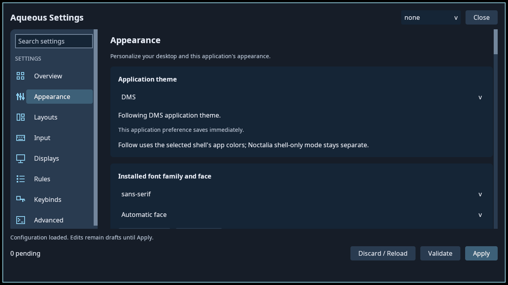

# Aqueous Settings

Standalone Quark UI settings application, built with Zig 0.16. The executable
is `aqueous-settings`, with desktop ID `org.aqueous.Settings`. Configuration
reading, schema validation, document preservation, backups, and toolkit
synchronization are compiled into the application under `src/backend/`.

The interface uses DMS-style navigation, rounded section cards, descriptive
rows, and global search. See the [implementation record](SETTINGS_LAYOUT_PLAN.md)
and [complete field/editor inventory](docs/SETTINGS_LAYOUT_INVENTORY.md).



[Light theme](docs/appearance-light.png) · [Compact layout](docs/appearance-compact.png) · [Search](docs/search-results.png) · [Setting controls](docs/opacity-card.png)

## Build and launch

Install Zig 0.16, a C toolchain, Python 3, pkg-config, shaderc (`glslc`), `wayland-scanner`, Wayland
development files, Vulkan headers/loader, Fontconfig, FreeType, libxkbcommon,
and a working Vulkan driver. Quark and its dependencies are pinned by
`build.zig.zon`; the first build needs access to their sources.

From the repository root:

```sh
zig build --build-file settingsApplication/build.zig -Doptimize=ReleaseSafe
settingsApplication/zig-out/bin/aqueous-settings --shell none
```

Or `zig build --build-file settingsApplication/build.zig run -- --page displays`.
The app needs a Wayland session and `XDG_RUNTIME_DIR`. `--shell auto` probes
running shell IPC services; neither shell, or ambiguous detection, selects
`none`. Explicit choices are `none`, `dms`, and `noctalia`. The UI runs without
either shell. Neutral mode still permits explicit toolkit synchronization.

`--page` accepts `overview`, `appearance`, `layouts`, `input`, `displays`,
`rules`, `keybinds`, or `advanced`. A second launch selects a page in the
existing instance and requests activation through `aqueousctl`, preserving
its drafts and shell selection.

## Editing and operation safety

All eight pages share one draft. Schema controls include defaults and numeric
constraints. Collection editors cover monitors, snap layouts/zones, ordered
window rules, and custom keybindings. Advanced exposes the complete six TOML
files. Click a built-in or custom shortcut to record a key combination. Press
and release the keys, then choose **Use shortcuts** to stage the change.
Built-in actions support multiple alternatives; use **Add shortcut** or remove
individual alternatives. Removing every alternative unbinds the action.
**Escape** or **Cancel** leaves the existing binding unchanged. Desktop shortcuts
are inhibited while recording, and resume when recording stops or the dialog
closes. Function, arrow, and supported media keys work alongside modifiers.
Unsupported keys show an error rather than saving a binding Aqueous cannot use.
Raw configuration remains available for manually editing bindings.
Long dropdowns support wheel browsing. Tab/Shift-Tab traverse controls and
scroll the focused control into view. Arrow keys change focused dropdowns and
sliders; Space/Enter activate toggles. Ctrl+F focuses global search, Enter opens
the first result, and Escape clears search or cancels the color picker. Search
results can also be reached with Tab and opened with Enter.

Window rules identify each rule by its app ID, class, title, and content type.
Choose a rule, edit its matching conditions and grouped behavior settings, then
Apply. Configured behavior settings appear first; **Show all settings** exposes
additional overrides. **No override** removes a setting from the rule, while
**On** and **Off** explicitly enable or disable it. Changed fields show their
saved values, and rule opacity accepts decimals from 0 to 1 (for example, 0.85).
The first matching rule wins. Moving a rule keeps it selected; apply or discard
the move before making other rule edits. Content-type matches show a reminder
that placement and layout settings are ignored for those rules.

Search matches names, IDs, descriptions, sections, and keywords such as
“transparency.” Selecting a result expands and highlights its setting. Search,
page changes, resizing, and theme changes retain drafts and in-progress text.
Each page retains its scroll position and section expansion during the session.

Numeric rows have exact text entry, steppers, and sliders for useful bounded
ranges. Global opacity is displayed as a percentage and stored in its existing 0–1
format. Invalid input remains visible beside its error. Color rows offer a swatch
and a picker with exact `0xAARRGGBB` entry, four channels, preview, Cancel, and
Use color. Reset restores the backend default; these actions remain staged.

At narrow widths or with enlarged fonts, a page chooser replaces the sidebar,
setting controls stack below descriptions, and collection actions stack
vertically. The minimum supported logical window is 760×520. The action bar
stays below the scrollable content; partially visible controls render and accept
input only inside their viewport.

Validate checks the entire draft without writing. Apply retains the loaded
generation and uses the existing backup, atomic replacement, and rollback
implementation. Raw and structured edits affecting the same file must be
resolved before saving. External changes retain the draft. Uncertain writes
require inspecting saved files and explicitly reconciling in Advanced.

After a successful Apply, the app runs `aqueousctl session reload --json` and
checks the compositor's acknowledgement. A failed or unavailable reload keeps
the saved settings and displays a warning; Apply can retry with no new edits.
This requires the updated `aqueousctl` and a running compositor supporting
shell protocol version 2. Restart the session after upgrading an older compositor.
Automatic file watching remains active, but is not treated as confirmation.

Configuration jobs run on one worker with an operation-owned arena. The UI
freezes editing until completion. **Cancel operation** can abort preparation;
once saving begins, the worker completes its save/rollback attempt. Window
close respects a running job. External commands have a five-second maximum
and share a thirty-second operation budget. Blocking filesystem operations
are allowed to finish; no thread is killed during file writes. Cancellation
is cooperative and may wait for the current bounded command to return.

Canonical save and toolkit/DMS synchronization are reported separately.
Synchronization failures after a save offer an explicit retry, without
repeating canonical edits. Opening the application never initiates font or
cursor synchronization.

Display positions, scale, transformations, mirroring, and modes stay staged.
Use `WIDTHxHEIGHT` for automatic refresh or `WIDTHxHEIGHT@Hz` for exact refresh.
**Refresh connected displays** updates live observations while preserving the
base generation and drafts, including disconnected outputs. Overview's
**Switch layout now** is an immediate workspace action.
Its dropdown reads the selected output's active workspace from the compositor
and refreshes on Overview once per second. It does not display the saved default
from `layout.toml`. A selection awaiting **Switch layout now** is retained until
the workspace/output changes; unavailable live state is shown explicitly.

UI preferences live in `$XDG_CONFIG_HOME/aqueous/settings-application.json`.
Backups go to `$XDG_STATE_HOME/aqueous/settings-application/backups`, with
standard home fallbacks. Canonical paths and old plugin backups are unchanged.

## Follow DMS or Noctalia appearance

Appearance now has an **Application theme** selector: **Follow shell**, **DMS**,
**Noctalia**, or **Built-in**. The preference saves immediately. Colors, fonts,
and basic rounding update live while preserving editor state; this does not
write canonical settings or trigger Apply/reload.

Enable one of the shipped palette templates using the
[theme setup instructions](packaging/themes/README.md). Installed templates and
registration examples live under `/usr/share/aqueous/settings-application/themes/`
(or the package's custom prefix). DMS and Noctalia generate separate versioned
JSON files in the XDG cache directory. Neither retired settings plugin is needed.
Missing/invalid exports and font fallback are reported in Appearance. A missing
export costs the shell's colors only: the typeface still follows the shell, and
falls back to Fontconfig's default sans when the shell names no family.

Noctalia follows its application theme mode, including automatic changes; its
shell-only mode override remains separate. Source readers target DMS JSON and
Noctalia v5 TOML. Palette generation was tested with DMS 1.6.1 and Noctalia 5.0.1.
See the setup guide for field mappings, bounds, and fallback behavior.

## Shell integration and upgrading

The former DMS `aqueousSettings` and Noctalia `aqueous/settings` settings
plugins are removed. Launch **Aqueous Settings** from the application menu or
run `aqueous-settings`. The app uses its embedded backend; its `--helper` option
remains retired. `aqueous-config` is shipped for DMS providers and external
scripts, using the same backend and protocol 1. It supports `version`, `snapshot`,
`validate`, `apply`, and `raw`, including `--shell dms` and `--request -`.
Build just the CLI with `zig build --build-file settingsApplication/build.zig config -Dmodel-only=true`.

Package-manager upgrades remove package-owned old plugin files. For a previous
Gentoo script installation, uninstall its recorded manifest before installing
the new build so obsolete system files are removed; modified tracked `/etc`
configuration and per-user settings are preserved by that script. Custom shell bars,
user plugin copies, settings, and backups are preserved. For existing profiles:

- Remove old Aqueous Settings widgets and plugin enablement in the shell UI.
- In a hand-written Noctalia config, remove `aqueous_settings` bar references,
  `[widget.aqueous_settings]`, and `aqueous/settings` from enabled plugins.
  Remove the `aqueous` path source pointing to the retired
  `/usr/share/aqueous/noctalia-plugins` only if it serves no other plugins.
- Replace old panel-toggle or `dms ipc call aqueousSettings …` bindings with
  `aqueous-settings --shell noctalia` or `aqueous-settings --shell dms`.
- Remove manually installed copies of those two settings plugins through their
  original installation mechanism. Do not remove unrelated shell plugins.

Noctalia typography remains in the embedded backend. DMS uses the optional
`aqueousSettingsAppearance` daemon shipped under `packaging/dms-appearance/`.
Enable that bridge in DMS when using DMS typography synchronization. It targets
DMS 1.7's SettingsData service and confirms both live and persisted family,
weight, and normal text size. Face/slant/width and separate bar scales remain
partially supported. Missing bridge or failed persistence is reported separately
from the canonical save. The bridge has no editor or background synchronizer.
Portal plugins and shell startup retain their independent roles.

## Install and package

```sh
DESTDIR=/tmp/aqueous-settings-stage PREFIX=/usr \
  settingsApplication/packaging/install.sh
```

`packaging/dev-install.sh` builds and installs under `~/.local`. Supported
installer overrides are `AQUEOUS_SETTINGS_BINARY`, `AQUEOUS_CONFIG_BINARY`, `PREFIX`, `DESTDIR`,
`SYSCONFDIR`, and `AQUEOUS_SETTINGS_BRIDGE_DISCOVERY`. System packages discover
the optional DMS bridge under `/etc/xdg/quickshell/dms-plugins`; personal installs
use the DMS user plugin path. No installer enables the bridge automatically.
The helper defaults to `aqueous-config` beside the selected application binary.
Arch, release/binary, Nix, and Gentoo recipes build the embedded application.

## Validation

```sh
zig build --build-file settingsApplication/build.zig test test-driver -Dmodel-only=true
zig build --build-file settingsApplication/build.zig test-ui-model
settingsApplication/tests/test-backend.sh
settingsApplication/tests/test-packaging.sh
python3 settingsApplication/tests/test-retirement.py
python3 settingsApplication/tests/test-dms-bridge.py
AQUEOUS_SETTINGS_TEST_INPUT=1 python3 settingsApplication/tests/test-ui.py
python3 settingsApplication/tests/test-theme-templates.py
AQUEOUS_SETTINGS_TEST_THEME=dms AQUEOUS_SETTINGS_TEST_INPUT=1 python3 settingsApplication/tests/test-ui.py
AQUEOUS_SETTINGS_TEST_THEME=noctalia AQUEOUS_SETTINGS_TEST_THEME_MODE=light python3 settingsApplication/tests/test-ui.py
```

The `test-driver` target builds the same CLI entry point as `aqueous-backend-test`
for regression fixtures. That test binary is not installed by application packages or
required by the app. Model/backend tests need no Quark build or display. Backend
integration tests use temporary XDG profiles; the optional equivalence test
accepts a preserved legacy executable as its comparison oracle.

UI tests start an isolated headless Aqueous compositor. They need a Vulkan
software driver and a compositor built with Pixman support; use
`AQUEOUS_COMPOSITOR_BIN` to select that build. Input tests additionally need
`wayland-scanner`, a C compiler, and Wayland/xkbcommon development files.
Build `test-driver` before running UI tests: they compare all 218 snapshot
fields with the controls on each page. `AQUEOUS_SETTINGS_TEST_INSPECT` is an
opt-in testing hook that writes control identities, bounds, and current text;
leave it unset during normal use.
`AQUEOUS_SETTINGS_ARTIFACTS` saves screenshots and control inventories with `grim`, and
`AQUEOUS_SETTINGS_TEST_PAGES` narrows page coverage. The DMS bridge test runs
real Quickshell with an isolated SettingsData fixture.
`AQUEOUS_SETTINGS_TEST_SIZE=760x520` requests an exact test window;
`AQUEOUS_SETTINGS_TEST_FONT=32` enlarges the shell font fixture;
`AQUEOUS_SETTINGS_TEST_SCALE=1.25` changes the isolated headless output scale;
`AQUEOUS_SETTINGS_TEST_OUTPUT=1920x1080` provides room for large-window tests.
Size/scale overrides are intended for page tests; the input suite uses the
standard 1280×720 output and sidebar navigation.

Theme UI tests require `grim` and Python Pillow, check rendered palette colors,
and exercise live light/dark and font-size changes without losing raw-editor
selection or drafts. `AQUEOUS_SETTINGS_TEST_THEME_MODE` selects the initial mode
for all eight pages. Template tests run the installed DMS/Noctalia generators
in temporary profiles. `test-ui-model` checks Quark widget ownership and sizing
without opening a display.

## Remaining platform validation

The embedded migration has automated backend, page-rendering, input, and
package-staging coverage. Physical-monitor acceptance, mixed-scale/hotplug
hardware checks, and full real-session typography/upgrade checks remain release
validation. Nix and Gentoo recipes have not been built in their target systems.

The pinned Quark requires the fixes described in [quark/README.md](quark/README.md).
The raw editor lacks syntax highlighting, undo history, and visible multiline
selection highlighting. IME composition and screen-reader integration are not
implemented. The redesign adds wrapping, partial clipping, keyboard focus and
scrolling, but does not add IME or accessibility-protocol support. See [the migration record](BACKEND_MIGRATION_PLAN.md).

System bell settings are under **Appearance → System bell**: choose visual
feedback, custom sound, both, or off; set a sound-file path and stream volume.
Relative paths are resolved against `wm.toml`. Empty paths and zero volume disable
sound. Use PCM WAV (or Ogg Vorbis when the installed `pw-play` supports it); sounds
are limited to two seconds. Applying changed bell settings stops existing feedback
and reloads the compositor. See the [compositor guide](../compositor/README.md#system-bell).
